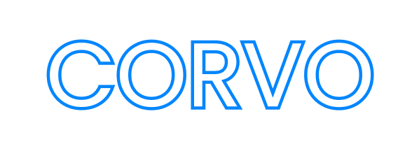

# [](https://travis-ci.com/boranseckin/corvo) 

Corvo is a web application development playground of mine. I am trying to develop different apps that would enhance some of the basic stuff I do regularly. You might think now, there are really good products already on the market that would the job, why bother... Well, I like programming and I want to get better at it. I also don't like watching tutorials for hours and copying someone else's work. I learn best when I try and most importantly struggle. Therefore, I am doing things in my way and hopefully, one day, I can develop an app that would be the best on the market.

The project is hosted at [https://corvoapp.com](https://corvoapp.com). More details at [hosting](#hosting) section.

If you would like to check it out either singup or use the username ```test``` and password ```password```.

## Contents

- [HW Tracker](#hw-tracker)
- [URL Shortener](#url-shortener)

### HW Tracker

Homework Tracker is a web app to keep track of assignments across multiple subjects. It provides a brief summary page with each subject's information and a thorough detail page for all listed subjects. The user can create classes and add new assignments to those classes by filling out the modal forms at the summary (home) page. The detail pages offer lists of active assignments with the options of editing, completing and deleting. Classes and assignments are only visible to the user who created them.

### URL Shortener

URL Shortener is a one page app to create short and humane URLs. It has a form to submit a long URL and a reactive list to show shortened version of it. The user can specify the duration of the shortened URL. Each created URL is private and unique for the user.

In order to use the shortened URL, paste your 5 character code after `/r/` path.

Example: `http://corvoapp.com/r/SHORTENED_URL`

## Installation

These instructions will get you a copy of the project up and running on your local machine for development and testing purposes. This method should not be used for staging or production. If you want to deploy your own copy of the app please refer to the [official documentation](https://guide.meteor.com/build-tool).

### Prerequisites

On Windows, use the installer can be found at https://www.meteor.com/install.

On Linux/MacOS, use this line:
```
curl https://install.meteor.com/ | sh
```
To make sure it is installed, you can run:
```
meteor --version
```

### Installing

Clone the repository:
```
git clone https://github.com/boranseckin/corvo.git
```
Inside the project folder use this line to install all npm dependencies:
```
meteor npm install
```
Finally, run:
```
meteor run
```
If you visit http://localhost:3000, you should see the app up and running.

#### Using Docker

The [Dockerfile](Dockerfile) is configured for a full Meteor setup over the latest Node image. It will install Meteor and all required NPM modules, then, it will run the code in development environment.

The project is already pushed to Docker Hub. Use the code below to pull the Docker repository:
```
docker pull boranseckin/corvo:latest
```

Then, run the following code to run the project in a detached container with the port 3000 exposed:
```
docker run -d -p 3000:3000 boranseckin/corvo
```

### Testing

Meteor uses [Mocha](https://mochajs.org/) test framework and [Chai](https://www.chaijs.com/) assertion library.

To run a one time test, use this line:
```
meteor npm test
```
To run the app in "test mode" and be able to edit it while testing, use this line instead:
```
meteor npm run test-app
```

## Hosting

The latest version of Corvo is hosted at [https://corvoapp.com](https://corvoapp.com). Feel free to visit the website, create an account and use all the features it offers. All the created content is private and unique for each user. If you do not want to signup; you can use the test account:

Username: ```test``` Password: ```password```

This project is in **staging** environment and it is not finalised, therefore, you should be expecting data loses or unexpected behaviours. I do my best to keep the app stable but please use at your own risk!

If you have an issue or a suggestion please fill out an issue form.

## Built With

* [Meteor](https://www.meteor.com/) - The web framework used
* [ReactJS](https://reactjs.org/) - The user interface library used
* [MongoDB](https://www.mongodb.com/) - The database program used
* [Ant.Desing](https://ant.design.com/) - The UI framework used

## Author

* **Boran Seckin**

## License

This project is licensed under the MIT License - see the [LICENSE.md](LICENSE.md) file for details.
